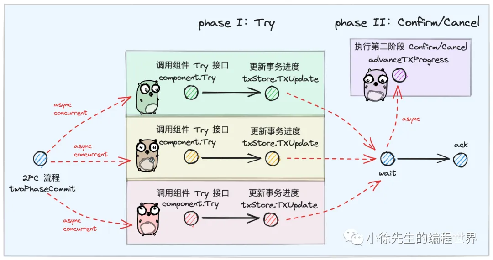

# 从零到一搭建 TCC 分布式事务框架

https://mp.weixin.qq.com/s?__biz=MzkxMjQzMjA0OQ==&mid=2247484619&idx=1&sn=2415f0b9c1e043c22ae2fd6d75d6cbb3

## 1 架构设计

1. 整体架构


2. TCC Component
   
3. TX Manager
   
4. TX Store
   
5. RegistryCenter

## 2 TXManager 核心源码讲解

1. 类图
   • TXManager：事务协调器，class
   • TXStore：事务日志存储模块，interface
   • registryCenter：TCC 组件注册管理中心，class
   • TCCComponent：TCC 组件，interface 2. 核心类定义
2. 注册组件
3. 事务主流程
   
   
   
   • 倘若所有组件的 Try 响应都是成功，则需要批量调用组件的 Confirm 接口，并在这之后将事务状态更新为成功
   • 倘若存在某个组件 Try 响应为失败，则需要批量调用组件的 Cancel 接口，并在这之后将事务状态更新为失败
   • 倘若当前事务已执行超时，同样需要批量调用组件的 Cancel 接口，并在这之后将事务状态更新为失败

4. 异步轮询流程
   倘若存在事务已经完成第一阶段 Try 操作的执行，但是第二阶段没执行成功，则需要由异步轮询流程进行兜底处理，为事务补齐第二阶段的操作，并将事务状态更新为终态。
   

   有关于轮询时间间隔的退避谦让策略为：每次对时间间隔进行翻倍，封顶为初始时长的 8 倍.

## 3 GOTCC 使用案例讲解

1. TCC 组件实现
   
   
   
2. TX Store 实现
   
3. 使用代码示例

```go
const (
    dsn      = "请输入你的 mysql dsn"
    network  = "tcp"
    address  = "请输入你的 redis ip"
    password = "请输入你的 redis 密码"
)

// 使用 tcc 单测代码
func Test_TCC(t *testing.T) {
    // 创建 redis 客户端
    redisClient := pkg.NewRedisClient(network, address, password)
    // 创建 mysql 客户端
    mysqlDB, err := pkg.NewDB(dsn)
    if err != nil {
        t.Error(err)
        return
    }

    // 构造三个 tcc 组件
    componentAID := "componentA"
    componentBID := "componentB"
    componentCID := "componentC"
    componentA := NewMockComponent(componentAID, redisClient)
    componentB := NewMockComponent(componentBID, redisClient)
    componentC := NewMockComponent(componentCID, redisClient)


    // 构造出事务日志存储模块
    txRecordDAO := dao.NewTXRecordDAO(mysqlDB)
    txStore := NewMockTXStore(txRecordDAO, redisClient)


    // 构造出 txManager 模块
    txManager := txmanager.NewTXManager(txStore, txmanager.WithMonitorTick(time.Second))
    defer txManager.Stop()


    // 完成三个组件的注册
    if err := txManager.Register(componentA); err != nil {
        t.Error(err)
        return
    }


    if err := txManager.Register(componentB); err != nil {
        t.Error(err)
        return
    }


    if err := txManager.Register(componentC); err != nil {
        t.Error(err)
        return
    }


    ctx, cancel := context.WithTimeout(context.Background(), time.Second*30)
    defer cancel()
    // 启动分布式事务
    success, err := txManager.Transaction(ctx, []*txmanager.RequestEntity{
        {ComponentID: componentAID,
            Request: map[string]interface{}{
                "biz_id": componentAID + "_biz",
            },
        },
        {ComponentID: componentBID,
            Request: map[string]interface{}{
                "biz_id": componentBID + "_biz",
            },
        },
        {ComponentID: componentCID,
            Request: map[string]interface{}{
                "biz_id": componentCID + "_biz",
            },
        },
    }...)
    if err != nil {
        t.Errorf("tx failed, err: %v", err)
        return
    }
    if !success {
        t.Error("tx failed")
        return
    }

    // 分布式事务处理成功
    t.Log("success")
}
```

## 4 总结
