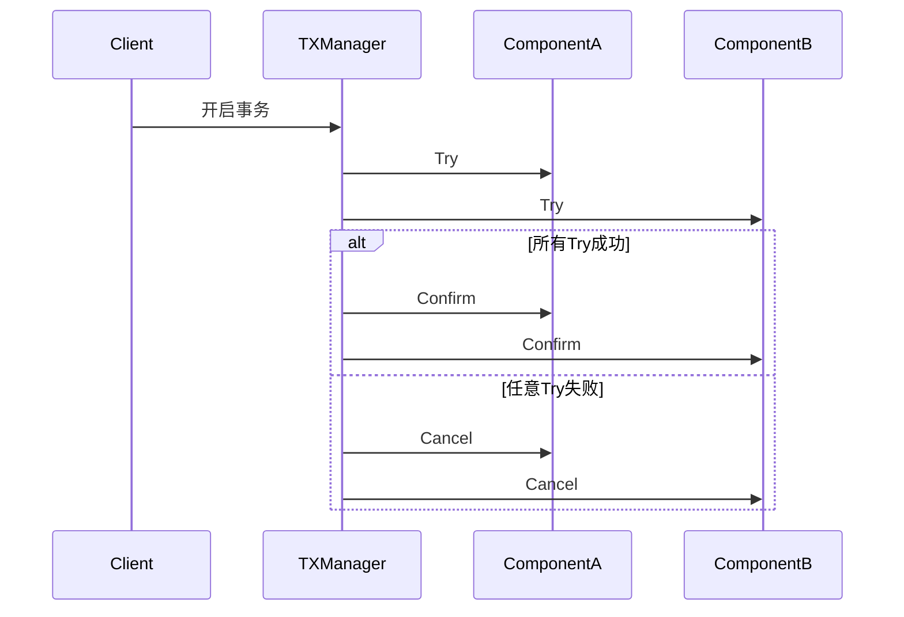

### 从零到一搭建 TCC 分布式事务框架详解

#### 一、核心概念与架构设计

TCC（Try-Confirm/Cancel）是一种基于两阶段提交（2PC）的分布式事务解决方案，通过将业务操作拆分为三个阶段实现事务的最终一致性。

##### 1.1 核心角色

- **TCC 组件**：业务操作的抽象，需实现 Try、Confirm、Cancel 方法
- **TXManager**：事务协调者，负责事务生命周期管理
- **TXStore**：事务日志存储模块（需用户自定义实现）
- **RegistryCenter**：TCC 组件注册中心

##### 1.2 事务流程

1. **Try 阶段**：冻结资源，记录预备操作
2. **Confirm/Cancel 阶段**：根据 Try 结果提交或回滚
3. **异步补偿**：通过轮询任务处理未完成事务

#### 二、核心模块实现详解

##### 2.1 TXManager 事务协调器

```go
type TXManager struct {
    txStore        TXStore          // 事务日志存储
    registryCenter *registryCenter  // 组件注册中心
    opts           *Options         // 配置项
    ctx            context.Context  // 生命周期控制
}

// 创建新事务
func (t *TXManager) Transaction(ctx context.Context, reqs ...*RequestEntity) (bool, error) {
    // 1. 获取事务组件
    // 2. 创建事务记录
    // 3. 执行两阶段提交
}
```

关键功能：

- 协调两阶段提交流程
- 管理异步补偿任务
- 处理超时与重试机制

##### 2.2 TCC 组件实现规范

```go
type TCCComponent interface {
    Try(ctx context.Context, req *TCCReq) (*TCCResp, error)
    Confirm(ctx context.Context, txID string) (*TCCResp, error)
    Cancel(ctx context.Context, txID string) (*TCCResp, error)
    ID() string
}
```

示例组件实现：

```go
type AccountComponent struct {
    client *RedisClient
}

func (a *AccountComponent) Try(ctx context.Context, req *TCCReq) (*TCCResp, error) {
    // 冻结账户资金
    key := fmt.Sprintf("account:freeze:%s", req.TXID)
    return a.client.SetNX(ctx, key, req.Amount)
}
```

##### 2.3 TXStore 事务日志存储

接口定义：

```go
type TXStore interface {
    CreateTX(ctx context.Context, components ...TCCComponent) (string, error)
    TXUpdate(ctx context.Context, txID string, componentID string, accept bool) error
    GetHangingTXs(ctx context.Context) ([]*Transaction, error)
    // ...其他方法
}
```

MySQL 实现示例：

```go
type MySQLStore struct {
    db *gorm.DB
}

func (m *MySQLStore) CreateTX(ctx context.Context, components ...TCCComponent) (string, error) {
    txRecord := TXRecord{
        Status:     "pending",
        Components: serializeComponents(components),
    }
    return m.db.Create(&txRecord).Error
}
```

#### 三、关键机制解析

##### 3.1 两阶段提交流程



##### 3.2 异步补偿机制

```go
func (t *TXManager) run() {
    for {
        select {
        case <-t.ctx.Done():
            return
        case <-time.After(tick):
            // 1. 获取未完成事务
            // 2. 分布式锁检查
            // 3. 推进事务状态
            t.batchAdvanceProgress(txs)
        }
    }
}
```

关键特性：

- 指数退避策略避免雪崩
- 分布式锁保证集群安全
- 最终一致性保证

#### 四、最佳实践与注意事项

1. **幂等性设计**：

   - 所有操作需支持重复执行
   - 使用唯一事务ID标识操作

   ```go
   func (c *OrderComponent) Confirm(ctx context.Context, txID string) {
       if exists(txID) {
           return // 幂等处理
       }
       // 执行业务逻辑
   }
   ```

2. **超时控制**：

   ```go
   func NewTXManager(store TXStore, opts ...Option) *TXManager {
       defaultOpts := &Options{
           Timeout:     30 * time.Second,
           MonitorTick: 5 * time.Second,
       }
   }
   ```

3. **异常处理建议**：
   - 记录详细事务日志
   - 提供人工干预接口
   - 监控关键指标（挂起事务数、补偿成功率等）

#### 五、扩展与优化方向

1. **性能优化**：

   - 异步Confirm/Cancel执行
   - 批量事务处理
   - 日志存储分片

2. **高可用设计**：

   ```go
   type ClusterStore struct {
       primary   TXStore
       secondary TXStore
   }

   func (c *ClusterStore) CreateTX(ctx context.Context, components ...TCCComponent) (string, error) {
       // 双写策略
   }
   ```

3. **生态集成**：
   - 支持多种存储引擎（ETCD、MongoDB等）
   - 提供可视化监控界面
   - 生成分布式事务调用链

#### 总结

本文完整阐述了TCC分布式事务框架的实现原理，从架构设计到核心代码实现，再到具体使用示例。关键点包括：

1. 清晰的角色划分（TXManager、TCCComponent等）
2. 可靠的事务状态持久化机制
3. 完善的异常处理与补偿流程
4. 灵活的扩展能力设计

实际应用中需根据业务特点进行调整，建议重点关注：

- 事务日志的存储性能
- 网络分区场景的容错处理
- 与现有微服务体系的集成

> 项目地址：https://github.com/xiaoxuxiansheng/gotcc  
> 更多实践案例可参考项目中的示例代码和测试用例。
